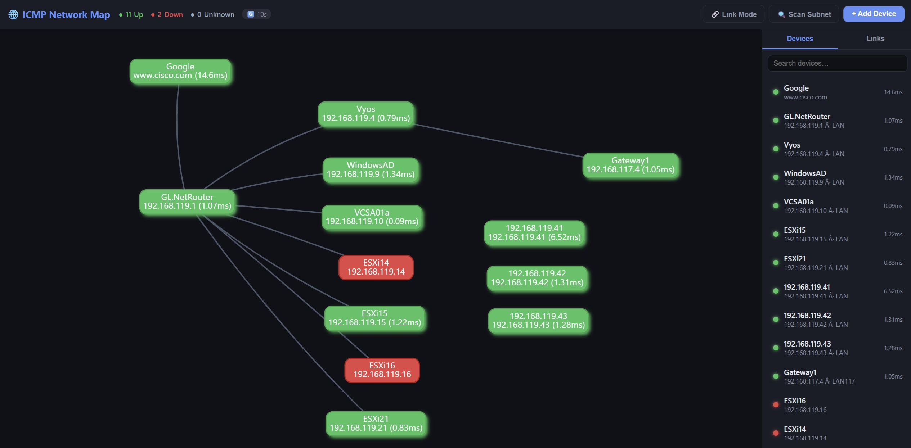
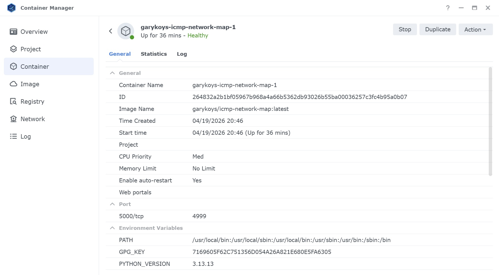
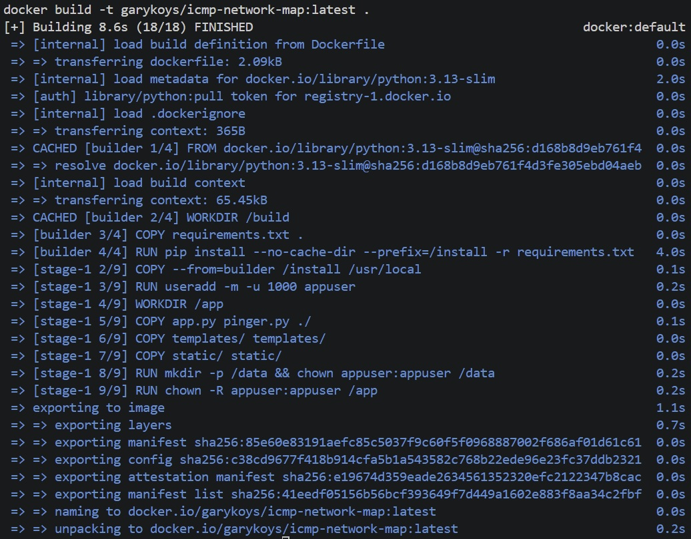
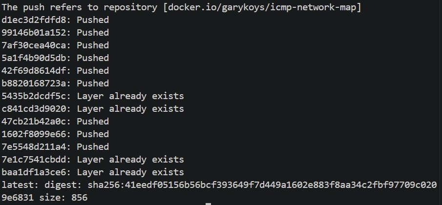

# ICMP Network Map

A lightweight web application that monitors network device **up/down** status using ICMP ping and displays a live topology map in the browser.

---

## Features

- **Live topology map** — interactive vis.js graph showing all devices and links
- **Real-time status** — Server-Sent Events push ping results every 10 seconds
- **Subnet scanner** — enter a CIDR (e.g. `192.168.1.0/24`), ping every host in parallel, and add all reachable devices to the map in one step
- **Add / Edit / Delete** devices manually via the browser UI
- **Link management** — draw connections between devices in Link Mode; label each link (e.g. `1Gbps`, `WAN`)
- **Latency display** on each node and in the sidebar
- **On-demand ping** — REST endpoint to ping a single device immediately
- **HTTPS** — optional self-signed TLS; certificate is auto-generated on first boot and persisted to the data volume
- **Security hardened** — HTTP security headers (CSP, X-Frame-Options, X-Content-Type-Options), IP address validation, input length limits, XSS-safe tooltips
- **Persistent storage** — device list, links, and TLS cert saved to JSON/PEM files, mounted as a volume in Docker so data survives container restarts and upgrades
- **Dark UI** — clean dark-mode interface

---



---

## Requirements

- Python 3.11+
- **Administrator / root privileges** are required for raw ICMP sockets on Windows and Linux.  
  If not running as admin, the app automatically falls back to `subprocess` ping.

---

## Quick Start (local Python)

### 1. Install dependencies

```bash
pip install -r requirements.txt
```

### 2. Run the server (as Administrator on Windows)

```bash
python app.py
```

### 3. Open in browser

```
http://localhost:5000
```

To enable HTTPS locally:

```bash
set FLASK_HTTPS=true   # Windows
# or
export FLASK_HTTPS=true  # Linux/macOS
python app.py
# then open https://localhost:5000
```

---

## Docker

### Run locally with Docker Compose

```bash
mkdir -p data
docker compose up -d --build
```

Data is persisted to `./data/` on the host — restarting or rebuilding the container does not affect it.

---

## Deployment

Two deployment options are covered:

1. **Docker on Linux / WSL** — build and run locally
2. **Synology NAS** — push to Docker Hub, pull and run on the NAS

### Option 1 — Docker (Linux host or WSL)

#### Prerequisites

- Docker Engine 24+ and Docker Compose v2
- Linux host or WSL2 Ubuntu
- User must be in the `docker` group (or use `sudo`)

#### One-time WSL Docker setup

```bash
# Install Docker Engine (if not already installed)
curl -fsSL https://get.docker.com | sh
sudo usermod -aG docker $USER

# Start the daemon and activate the new group in the current shell
sudo service docker start
newgrp docker
```

#### Build and run

```bash
cd /mnt/c/Users/<you>/OneDrive/lab/icmp-network-map   # adjust path

# Create the data directory (persists devices.json, links.json, TLS certs)
mkdir -p data

# Build the image and start the container
docker compose build
docker compose up -d

# Watch logs
docker compose logs -f
```

Open **http://localhost:5000** (or **https://localhost:5000** if HTTPS is enabled).

#### Useful commands

```bash
# Stop
docker compose down

# Rebuild after code changes
docker compose build ; docker compose up -d --force-recreate

# Shell into running container
docker compose exec icmp-network-map sh
```

#### Why `network_mode: host`?

ICMP raw sockets need direct access to the host's network interfaces.  
`network_mode: host` + `cap_add: [NET_RAW, NET_ADMIN]` + `user: "0"` gives the container that access reliably across all kernel versions.

> **Docker Desktop on Windows / macOS**: `network_mode: host` connects to the
> Docker Desktop Linux VM, **not** your physical machine's interfaces.  
> Use WSL2 with Docker Engine (not Docker Desktop) to reach your real LAN,
> or run the app with plain `python app.py` instead.

---

### Option 2 — Synology NAS (Container Manager)

Synology DSM runs Linux, so `network_mode: host` and raw ICMP capabilities work natively.



#### Prerequisites

- DSM 7.2+ with **Container Manager** installed (Package Center)
- SSH access to the NAS
- Docker Hub account (image is published as `garykoys/icmp-network-map:latest`)

#### Step 1 — Build and push the image (from WSL)

```bash
cd /mnt/c/Users/<you>/OneDrive/lab/icmp-network-map

# Build
docker compose build

# Log in and push
docker login -u garykoys
docker compose push
```





#### Step 2 — Prepare the NAS

```bash
# Create project and data folders
ssh user@<your-nas-ip> "mkdir -p /volume1/docker/icmp-network-map/data"

# Seed your existing device and link data
scp data/devices.json user@<your-nas-ip>:/volume1/docker/icmp-network-map/data/devices.json
scp data/links.json   user@<your-nas-ip>:/volume1/docker/icmp-network-map/data/links.json

# Copy the Synology compose file
scp docker-compose.synology.yml user@<your-nas-ip>:/volume1/docker/icmp-network-map/docker-compose.yml
```

#### Step 3 — Start on the NAS

```bash
ssh user@<your-nas-ip>
cd /volume1/docker/icmp-network-map

docker compose pull
docker compose up -d
docker compose logs -f
```

Open **https://\<your-nas-ip\>:5000** in your browser.  
Accept the self-signed certificate warning on first visit (click **Advanced → Proceed**).

#### Step 4 — Update (after a code change)

```bash
# On WSL — rebuild and push new image
docker compose build ; docker compose push

# On the NAS — pull and restart
ssh user@<your-nas-ip>
cd /volume1/docker/icmp-network-map
docker compose pull
docker compose up -d --force-recreate
```

#### Data persistence

All runtime data lives in the mounted volume:

| File | Contents |
|------|----------|
| `<data-volume>/devices.json` | Device list |
| `<data-volume>/links.json` | Topology links |
| `<data-volume>/cert.pem` | TLS certificate |
| `<data-volume>/key.pem` | TLS private key |

Data survives container restarts, image updates, and `docker compose down`.

#### Port conflicts

If port 5000 conflicts with another DSM service, change `FLASK_PORT` in `docker-compose.yml`:

```yaml
environment:
  FLASK_PORT: "5001"
```

Then open that port in **DSM → Control Panel → Security → Firewall** if the firewall is enabled.

---

## Project Structure

```
icmp-network-map/
├── app.py                          # Flask server — REST API, SSE, HTTPS, static serving
├── pinger.py                       # Background ICMP ping engine + subnet scanner
├── requirements.txt                # Python dependencies (flask, icmplib, cryptography)
├── Dockerfile                      # Multi-stage Docker image (python:3.13-slim)
├── docker-compose.yml              # Local / Linux Docker Compose
├── docker-compose.synology.yml     # Synology NAS Docker Compose
├── data/                           # Runtime data (volume-mounted in Docker)
│   ├── devices.json                # Persisted device list
│   ├── links.json                  # Persisted topology links
│   ├── cert.pem                    # Auto-generated TLS certificate (created on first HTTPS boot)
│   └── key.pem                     # Auto-generated TLS private key
├── templates/
│   └── index.html                  # Main UI page
└── static/
    ├── style.css                   # Dark-mode styles
    └── app.js                      # Frontend logic (vis.js topology + SSE)
```

---

## REST API

| Method | Endpoint | Description |
|--------|----------|-------------|
| `GET` | `/api/devices` | List all devices with current status |
| `POST` | `/api/devices` | Add a device `{ name, ip, group?, notes? }` |
| `PUT` | `/api/devices/<id>` | Update a device |
| `DELETE` | `/api/devices/<id>` | Remove a device (cascades to links) |
| `POST` | `/api/devices/<id>/ping` | Trigger an immediate ping |
| `POST` | `/api/scan` | Scan a subnet `{ subnet, group? }` — pings all hosts in parallel and adds reachable ones |
| `GET` | `/api/links` | List all topology links |
| `POST` | `/api/links` | Add a link `{ source, target, label? }` |
| `PUT` | `/api/links/<id>` | Update a link label |
| `DELETE` | `/api/links/<id>` | Remove a link |
| `GET` | `/api/events` | SSE stream of live status / device / link events |

---

## Configuration

All settings can be overridden via environment variables (supported in Docker Compose and systemd):

| Variable | Default | Description |
|---|---|---|
| `DEVICES_FILE` | `./devices.json` | Path to the devices JSON file |
| `LINKS_FILE` | `./links.json` | Path to the links JSON file |
| `FLASK_HOST` | `0.0.0.0` | Bind address |
| `FLASK_PORT` | `5000` | Listen port |
| `PING_INTERVAL` | `10` | Seconds between ping sweeps |
| `FLASK_HTTPS` | `false` | Set to `true` to enable HTTPS with a self-signed certificate |

---

## HTTPS / TLS

When `FLASK_HTTPS=true`, the app:

1. Looks for `cert.pem` and `key.pem` in the same directory as `DEVICES_FILE` (i.e. `/data/` in Docker).
2. If they don't exist, generates a self-signed RSA-2048 certificate valid for 10 years, including SANs for `localhost`, `127.0.0.1`, and the container's LAN IP.
3. Starts Flask with that certificate.

The files are written to the mounted volume so they persist across restarts — your browser only shows the "Not secure" warning on the very first visit.

To use your own certificate instead, place your `cert.pem` and `key.pem` in the data directory before starting the container.

---

## Notes

- On **Windows**, running as Administrator is recommended for ICMP raw sockets.  
  If not elevated, the app falls back to `subprocess ping` automatically.
- The pinger tries **unprivileged ICMP** (no root needed on modern Linux kernels) first, then privileged raw socket, then subprocess ping.
- Subnet scan accepts any valid CIDR up to `/22` (1024 hosts max).  
  Network and broadcast addresses are excluded automatically.
- Deleting a device also removes all links connected to it.

---

## Security

The following hardening measures are applied (based on OWASP Top 10):

### HTTP Security Headers

Every response includes:

| Header | Value | Purpose |
|---|---|---|
| `X-Content-Type-Options` | `nosniff` | Prevent MIME-type sniffing |
| `X-Frame-Options` | `DENY` | Block clickjacking via iframes |
| `Referrer-Policy` | `no-referrer` | No referer leakage |
| `Content-Security-Policy` | see below | Restrict script/style/connect sources |

CSP policy: scripts allowed from `self` + `unpkg.com` (vis.js CDN only); styles from `self` + inline (required by vis.js); all other sources blocked.

### Input Validation

- **IP address** — validated with `ipaddress.ip_address()` on add and update; invalid values return `400`.
- **Field lengths** — `name` / `group` ≤ 64 chars; `notes` ≤ 256 chars; link `label` ≤ 64 chars.
- **Subnet** — validated with `ipaddress.ip_network()`, capped at `/22` (1024 hosts).

### XSS Prevention

- All device data (name, IP, group, notes) is HTML-escaped with `escHtml()` before being inserted into the DOM or vis.js tooltips.

### Known Limitations (acceptable for home-lab use)

- No authentication — intended for trusted LAN use only. Do not expose port 5000 to the internet.
- No rate limiting on `/api/scan`.
- vis.js loaded from CDN without Subresource Integrity (SRI) hash.
